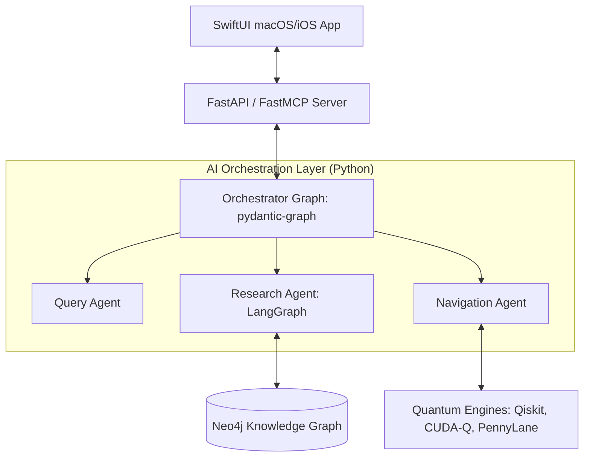

<p align="center">
  
</p>

# 🍲 Project Chicken Soup

<p align="center">
  
</p>

> **A Local-First AI Spacetime Navigation Engine & Lore Knowledge Graph.**
> Bridging quantum computing simulation (Qiskit, CUDA-Q, PennyLane) with a rich graph of UFO/Alien/Time Travel history.

> [!WARNING]
> **Active Development**
> This repository is under constant and rapid development. APIs, schemas, configurations, and user interfaces are subject to frequent breaking changes as new features are integrated.

---

## 🌌 Overview

Project Chicken Soup is a production-quality, local-first system that simulates time travel physics via quantum computation and orchestrates discovery through an AI agent network. The system couples a multi-agent backend with a local knowledge base of extraterrestrial and temporal lore.

### Key Capabilities
- **Spacetime Simulation**: Computes time dilation, gravity effects, and closed timelike curves (CTCs) using **Qiskit**.
- **Field Manipulation**: Models field-propulsion metrics using **CUDA-Q**.
- **QML Navigation**: Plots optimal temporal coordinates via **PennyLane** neural networks, targeting hardware from **D-Wave** and **IonQ**.
- **Lore Knowledge Graph**: Maps whistleblower claims, historic crashes, and scientific anomalies using a **Neo4j** graph.
- **Local-First LLMs**: Auto-discovers and falls back across local models (**oMLX** ➔ **Ollama** ➔ **LM Studio**).
- **Apple SwiftUI Client**: Native macOS & iOS application with a warm, "chicken soup" systemOrange accent theme (`#FF9500`) powered by **SwiftData**.

---

## 🏛️ System Architecture

Project Chicken Soup implements a decoupled, modern multi-agent architecture:



- **Orchestrator**: Managed via `pydantic-graph` for top-level routing.
- **Sub-workflows**: Complex data fusion and research pipelines orchestrated by `LangGraph` (featuring checkpointing, human-in-the-loop validation, and parallel execution).

---

## 🛠️ Technology Stack

| Layer | Technologies |
| :--- | :--- |
| **Frontend Client** | [SwiftUI](file:///Users/mck/Desktop/chickensoup/Project%20Chicken%20Soup) (macOS-first & iOS), SwiftData, Swift Testing |
| **API Layer** | FastAPI, FastMCP (Model Context Protocol) |
| **Agent AI** | Pydantic AI, `pydantic-graph`, LangGraph |
| **Databases** | Neo4j (Knowledge Graph), Redis (Caching) |
| **Quantum Tier** | Qiskit (Spacetime), CUDA-Q (Field), PennyLane (Pathfinding QML) |
| **Infrastructure** | Docker, Ray/Celery, OpenTelemetry, pytest |

---

## 📂 Project Structure

```
chickensoup/
├── development-docs/       # Project specifications & architecture docs
│   └── PROJECT_SPEC.md     # Core technical specification
├── wiki/                   # Markdown wiki (Overview, Index, Logs, Entities)
├── Project Chicken Soup/   # Native SwiftUI client project (iOS & macOS)
├── src/                    # Backend source code (FastAPI, Agents, Quantum)
├── tests/                  # Backend unit and integration tests
├── AGENTS.md               # LLM Agent instructions & wiki schema
├── CHANGELOG.md            # Project release log
└── pyproject.toml          # Python build config & dependencies
```

---

## 🚀 Getting Started

### 1. Requirements & Dependencies
- **Python**: 3.12+ (managed with `uv` or `.python-version`)
- **Xcode**: 16.0+ (for SwiftUI client)
- **Services**: Docker (for Neo4j & Redis)

### 2. Backend Setup
1. Clone this repository and enter the directory.
2. Initialize environment variables:
   ```bash
   cp .env.example .env
   ```
3. Boot services:
   ```bash
   docker-compose up -d
   ```
4. Install Python dependencies and launch the backend API:
   ```bash
   uv sync
   uv run uvicorn src.main:app --reload
   ```

### 3. SwiftUI Client Setup
1. Open the Xcode Project:
   ```bash
   open "Project Chicken Soup/Project Chicken Soup.xcodeproj"
   ```
2. Build and run target `Project Chicken Soup` on **macOS** or **iOS**.
3. *Optional*: Run unit tests using the modern **Swift Testing** framework (`@Test`).

---

## 📚 The Lore Wiki
The knowledge graph is hydrated directly from the structured markdown files located in the [wiki/](file:///Users/mck/Desktop/chickensoup/wiki) directory.
- Check the [Overview](file:///Users/mck/Desktop/chickensoup/wiki/overview.md) to explore key concepts.
- See the [Index](file:///Users/mck/Desktop/chickensoup/wiki/index.md) for a map of historical crashes, physics theories, and whistleblowers.

---

## 👥 Author

- **Mainza Kangombe** — [LinkedIn](https://www.linkedin.com/in/mainza-kangombe-6214295/)

---

## 📝 License
Proprietary / Research Project.
