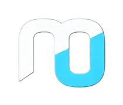

# Project Chicken Soup 🍜

A local-first AI system that simulates and explores time travel using quantum computation, with a rich knowledge graph of UFO/Alien/Time Travel lore and multi-agent AI orchestration.

## Three-Layer Quantum Pipeline

```
Spacetime Engine (Qiskit) → Field Manipulator (CUDA-Q) → AI Navigator (PennyLane)
```

The [[field-geometry-tensor]] is the contract between layers — each is a pure function taking and returning the metric tensor. Development progresses: classical fallback → local simulation → cloud simulation → real quantum hardware via IBM Quantum, D-Wave Leap, and IonQ.

## Multi-Agent System

| Agent | Framework | Role |
|-------|-----------|------|
| Orchestrator | pydantic-graph | Coordinates query → research → navigation → answer |
| Research | LangGraph | Neo4j knowledge graph exploration, evidence scoring |
| Navigation | pydantic-graph + LangGraph | Path computation via PennyLane QML |
| Query | pydantic-graph | Intent detection, query decomposition |

## Stack

| Layer | Tech |
|-------|------|
| Frontend | SwiftUI / SwiftData (macOS + iOS, Swift 6.4) |
| API | FastAPI + OpenAPI |
| Agents | Pydantic AI, pydantic-graph, LangGraph |
| Graph | Neo4j (source of truth) + SwiftData (offline cache) |
| Quantum | Qiskit, CUDA-Q, PennyLane, D-Wave, IonQ |
| LLM | oMLX → Ollama → LM Studio (auto-discovery) |
| MCP | FastMCP |
| Infra | Docker, Redis, OpenTelemetry |

## Design

Light mode default with **#FF9500** accent. macOS + iOS from a single codebase. The timeline is the primary view with a floating query overlay using Liquid Glass materials.

## Project Structure

```
chickensoup/
├── src/              # Python backend
├── wiki/             # 150+ page knowledge graph
├── papers/           # Source documents
├── assets/           # Logo & favicons
└── "Project Chicken Soup/"  # Xcode project
```

## Implementation Phases

| Phase | Focus |
|-------|-------|
| 1 — Foundation | KG schema, project structure, FastAPI, Docker |
| 2 — Core | Quantum circuits, LLM integration, wiki ingestion |
| 3 — Enhancement | Caching, async, observability, CI/CD |
| 4 — Advanced | Real quantum hardware, multi-LLM, full UI |

---

**Author:** Mainza Kangombe — [LinkedIn](https://www.linkedin.com/in/mainza-kangombe-6214295/)
