<p align="center">
  
</p>

# 🍲 Project Chicken Soup

<p align="center">
  
</p>

> **A Local-First AI Spacetime Navigation Engine & Lore Knowledge Graph.**
> Bridging quantum computing simulation (Qiskit, CUDA-Q, PennyLane) with a rich graph of UFO/Alien/Time Travel history.

> [!WARNING]
> **Active Development**
> This repository is under constant and rapid development. APIs, schemas, configurations, and user interfaces are subject to frequent breaking changes as new features are integrated.

---

## 🌌 Overview

Project Chicken Soup is a production-quality, local-first system that simulates time travel physics via quantum computation and orchestrates discovery through an AI agent network. The system couples a multi-agent backend with a local knowledge base of extraterrestrial and temporal lore.

### Key Capabilities

- **Spacetime Simulation**: Computes time dilation, gravity effects, and closed timelike curves (CTCs) using **Qiskit**.
- **Field Manipulation**: Models field-propulsion metrics using **CUDA-Q**.
- **QML Navigation**: Plots optimal temporal coordinates via **PennyLane** neural networks, targeting hardware from **D-Wave** and **IonQ**.
- **Lore Knowledge Graph**: Maps whistleblower claims, historic crashes, and scientific anomalies using a **Neo4j** graph.
- **Local-First LLMs**: Auto-discovers and falls back across local models (**oMLX** ➔ **Ollama** ➔ **LM Studio**).
- **Wiki Auto-Ingestion**: Upload files or folders — AI analyzes content and automatically creates wiki pages with cross-references.
- **Chat-to-Wiki Pipeline**: Periodic background conversion of user–AI conversations into wiki pages, research threads, and temporal events.
- **Apple SwiftUI Client**: Native macOS & iOS application with a warm, "chicken soup" systemOrange accent theme (`#FF9500`) powered by **SwiftData**.

---

## 🏛️ System Architecture

Project Chicken Soup implements a decoupled, modern multi-agent architecture:

<p align="center">
  
</p>

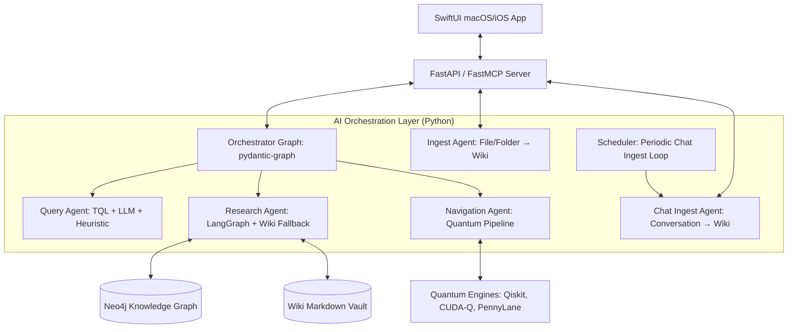

- **Orchestrator**: Managed via `pydantic-graph` for top-level routing with confidence gating.
- **Sub-workflows**: Complex data fusion and research pipelines orchestrated by `LangGraph` (checkpointing, human-in-the-loop, parallel execution).
- **File Ingest Agent**: Analyzes uploaded `.txt`/`.md`/`.json`/`.csv` files via LLM, extracts entities/concepts/projects, commits to wiki + Neo4j.
- **Chat Ingest Agent**: Periodically scans eligible conversations (10+ messages, 30min idle), extracts new wiki content, detects user names, identifies temporal references.
- **Scheduler**: Background asyncio loop (every 5 minutes) managing conversation eligibility, idempotency, research thread detection, and conversation snapshots.

---

## 📊 Presentation Slide Deck

An in-depth presentation outlining the project vision, quantum architectures, and local AI agent networks:

- 📥 **Download Deck**: [PDF Presentation](assets/other/Project_Chicken_Soup_Quantum_AI.pdf) | [PowerPoint PPTX](assets/other/Project_Chicken_Soup_Quantum_AI.pptx)

### Slides Preview

<p align="center">
  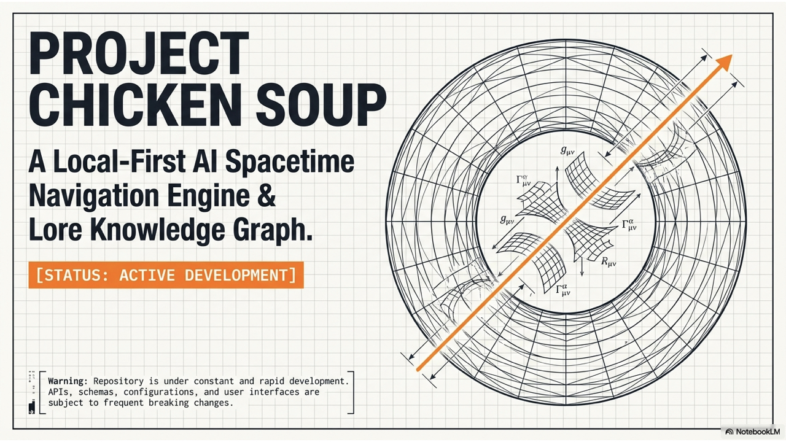
</p>

<details>
  <summary>🔍 Click to expand and view all 11 slides</summary>
  <br/>
  <p align="center">
    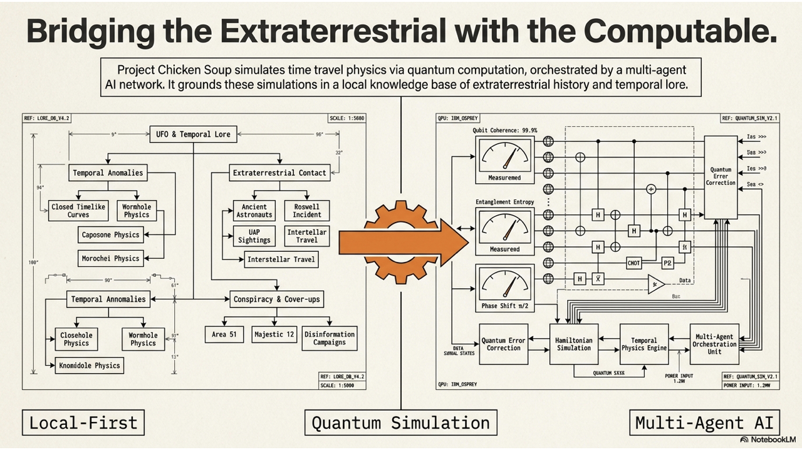<br/><br/>
    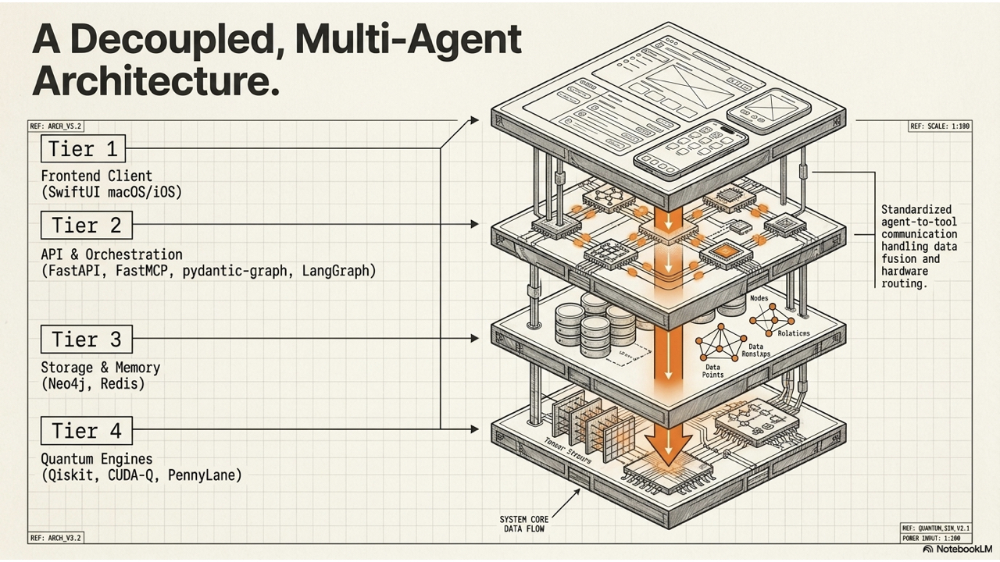<br/><br/>
    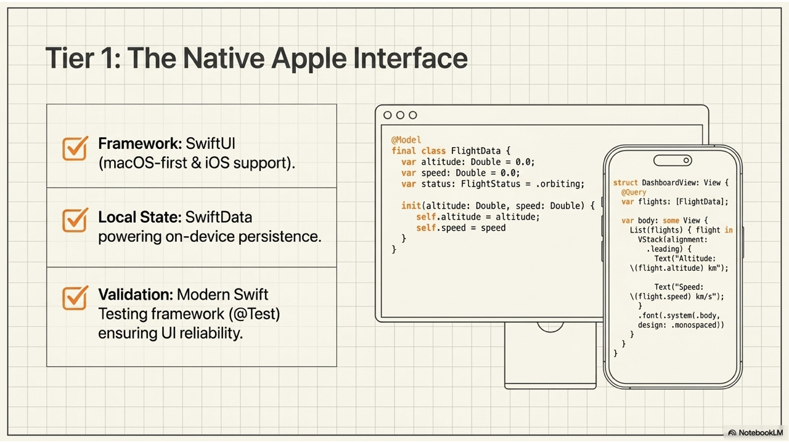<br/><br/>
    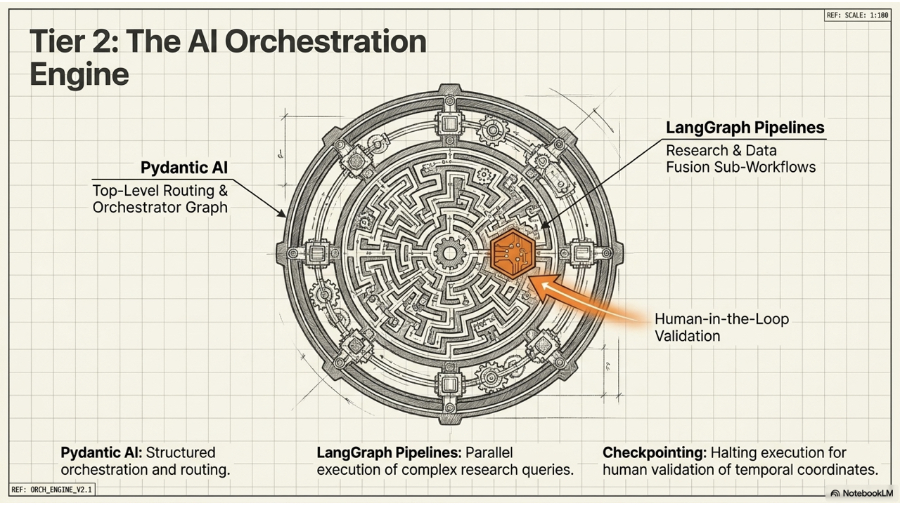<br/><br/>
    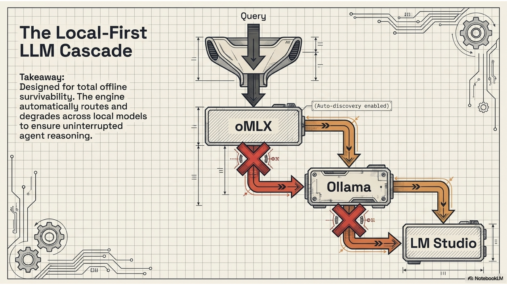<br/><br/>
    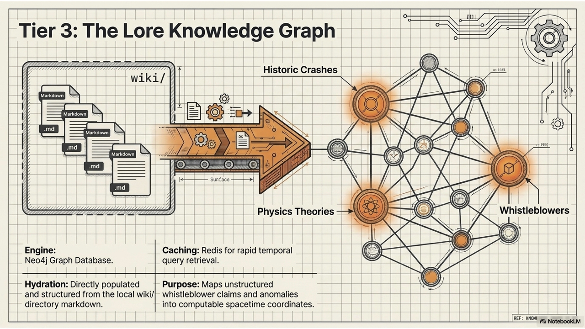<br/><br/>
    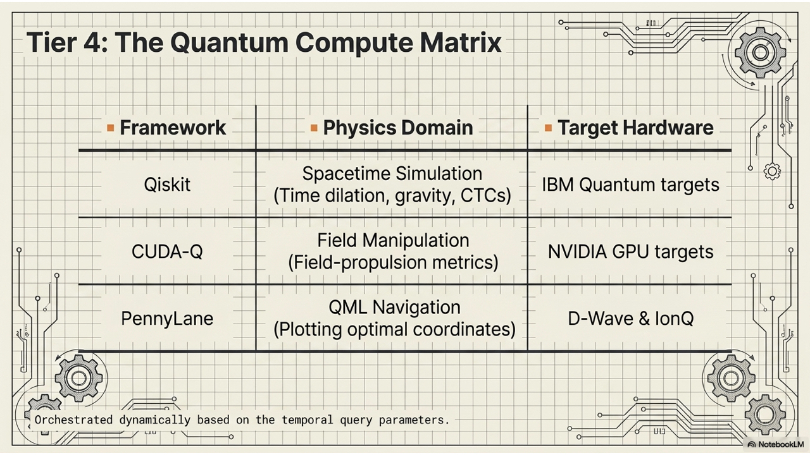<br/><br/>
    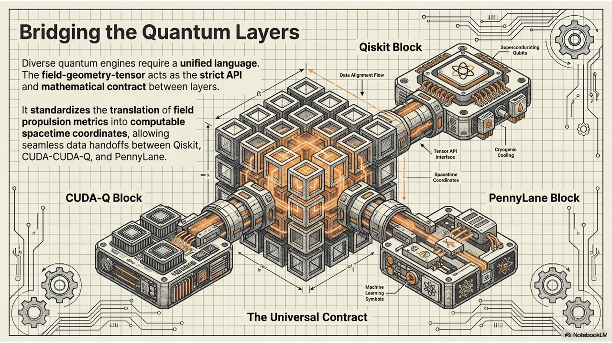<br/><br/>
    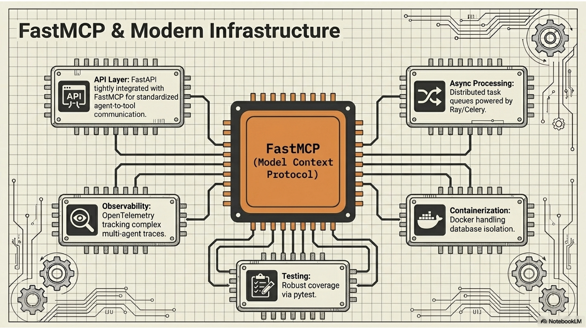<br/><br/>
    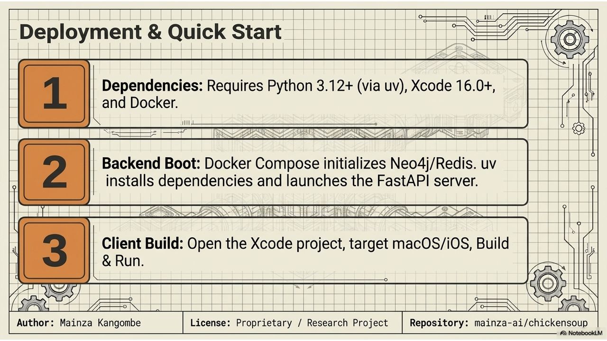
  </p>
</details>

---

## 📸 Screen Demonstrations & Video

### 🎥 Demo Video

Watch the Spacetime Navigation Engine & Lore Knowledge Graph in action:

[](https://www.youtube.com/watch?v=orRyWnZc4Ek)

🔗 **Link**: [Watch on YouTube](https://www.youtube.com/watch?v=orRyWnZc4Ek)

### 🖥️ Application Screenshots

<p align="center">
  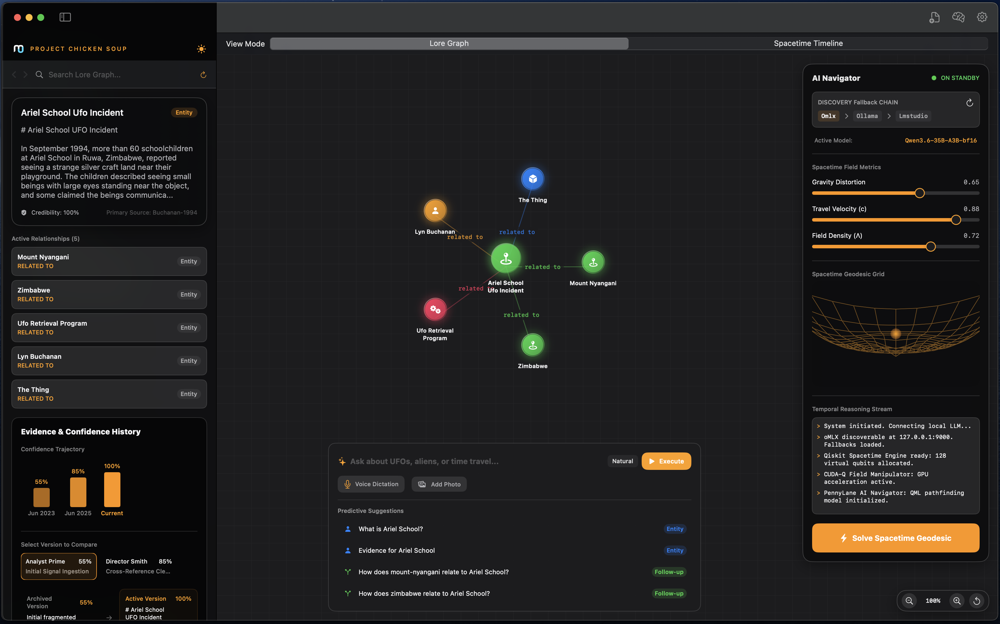
  <br/>
  <em>macOS Client Interactive Lore Graph Exploration</em>
</p>

<p align="center">
  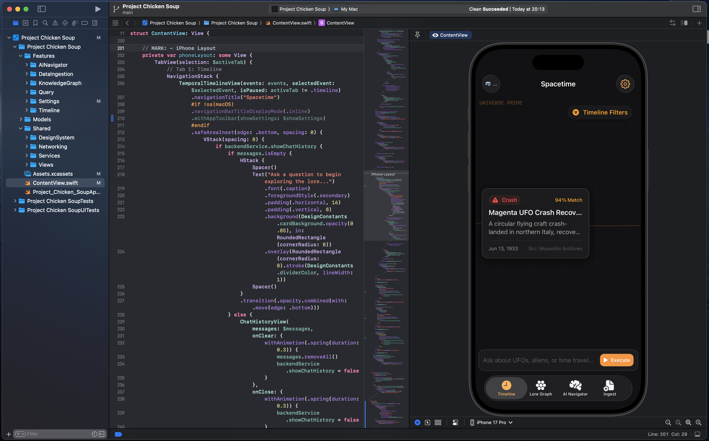
  <br/>
  <em>iOS Client Graph Exploration Interface</em>
</p>

---

## 🛠️ Technology Stack

| Layer | Technologies |
| :--- | :--- |
| **Frontend Client** | [SwiftUI](file:///Users/mck/Desktop/chickensoup/Project%20Chicken%20Soup) (macOS & iOS, 33+ files), SwiftData, Swift Testing |
| **API Layer** | FastAPI, FastMCP (Model Context Protocol) |
| **Agent AI** | Pydantic AI, `pydantic-graph`, LangGraph |
| **Databases** | Neo4j (Knowledge Graph), Redis (Cache + Conversation History) |
| **Quantum Tier** | Qiskit (Spacetime), CUDA-Q (Field), PennyLane (Pathfinding QML) |
| **Infrastructure** | Docker, Celery, OpenTelemetry, pytest |

---

## 📂 Project Structure

```
chickensoup/
├── development-docs/       # Project specifications & architecture docs
│   └── PROJECT_SPEC.md     # Core technical specification
├── wiki/                   # Markdown wiki (179 pages: entities, concepts, projects)
├── Project Chicken Soup/   # Native SwiftUI client (macOS & iOS, 33+ Swift files)
├── src/                    # Backend source code (22 Python files)
│   ├── main.py             # FastAPI entry point (30+ endpoints)
│   ├── config.py           # Pydantic Settings (24+ fields)
│   ├── scheduler.py        # Periodic chat-to-wiki background loop
│   ├── agents/             # 6 agents: orchestrator, query, research, navigation, ingest, chat-ingest
│   ├── wiki/writer.py      # Wiki page CRUD, cross-referencing, index/log
│   └── knowledge_graph/    # Neo4j connection, schema, ingest, queries
├── tests/                  # Backend unit and integration tests (9 files)
├── AGENTS.md               # LLM Agent instructions & wiki schema
├── CHANGELOG.md            # Project release log
└── pyproject.toml          # Python build config & dependencies
```

---

## 🚀 Getting Started

### 1. Requirements & Dependencies
- **Python**: 3.12+ (managed with `uv` or `.python-version`)
- **Xcode**: 16.0+ (for SwiftUI client)
- **Services**: Docker (for Neo4j & Redis)

### 2. Backend Setup
1. Clone this repository and enter the directory.
2. Initialize environment variables:
   ```bash
   cp .env.example .env
   ```
3. Boot services:
   ```bash
   docker-compose up -d
   ```
4. Install Python dependencies and launch the backend API:
   ```bash
   uv sync
   uv run uvicorn src.main:app --reload
   ```

### 3. SwiftUI Client Setup
1. Open the Xcode Project:
   ```bash
   open "Project Chicken Soup/Project Chicken Soup.xcodeproj"
   ```
2. Build and run target `Project Chicken Soup` on **macOS** or **iOS**.
3. *Optional*: Run unit tests using the modern **Swift Testing** framework (`@Test`).

---

## 📚 The Lore Wiki

The knowledge graph is hydrated from structured markdown files in the [wiki/](file:///Users/mck/Desktop/chickensoup/wiki) directory (179 pages and growing).

Pages are automatically created through two mechanisms:
- **File/Folder Upload**: Upload `.txt`/`.md`/`.json`/`.csv` files → AI analyzes content → wiki pages created with cross-references → synced to Neo4j.
- **Chat-to-Wiki Pipeline**: Enable in Settings → conversations with 10+ messages are periodically analyzed → entities, concepts, and projects extracted → wiki pages auto-created.

| Wiki Section | Count | Description |
|:---|---:|:---|
| Entities | 87 | People, places, objects, events, programs |
| Concepts | 85 | Theories, frameworks, ideas, claims |
| Projects | 6 | Engineering work, architecture, specifications |
| Raw | 1+ | Immutable source documents, conversation snapshots |

Additional features:
- **Research Thread Detection**: Topics discussed in 3+ conversations auto-create project pages.
- **Adaptive Confidence**: Repeated topics get confidence reinforcement across sessions.
- **Conversation Snapshots**: Full message history saved to `wiki/raw/` as immutable markdown.

---

## 👥 Author

- **Mainza Kangombe** — [LinkedIn](https://www.linkedin.com/in/mainza-kangombe-6214295/)

---

## 📝 License

Proprietary / Research Project.
