<p align="center">
  
</p>

# 🍲 Project Chicken Soup

<p align="center">
  
  
  
</p>

> **A Local-First AI Spacetime Navigation Engine & Lore Knowledge Graph with The Living Almanac.**
> Bridging quantum computing simulation (Qiskit, CUDA-Q, PennyLane) with a rich graph of UFO/Alien/Time Travel history — now scored by live, real-world claim evidence.

> [!WARNING]
> **Active Development**
> This repository is under constant and rapid development. APIs, schemas, configurations, and user interfaces are subject to frequent breaking changes as new features are integrated.

---

## 🌌 Overview

Project Chicken Soup is a production-quality, local-first system that simulates time travel physics via quantum computation and orchestrates discovery through an AI agent network. The system couples a multi-agent backend with a local knowledge base of extraterrestrial and temporal lore.

### Key Capabilities

- **Spacetime Simulation**: Computes time dilation, gravity effects, and closed timelike curves (CTCs) using **Qiskit** (AerEstimatorV2 pattern with NumPy fallback).
- **Field Manipulation**: Models field-propulsion metrics using **CUDA-Q** with resonance physics at 7.46 Hz.
- **QML Navigation**: Plots optimal temporal coordinates via **PennyLane** neural networks, targeting hardware from **D-Wave** and **IonQ**. SciPy Nelder-Mead fallback.
- **Lore Knowledge Graph**: Maps whistleblower claims, historic crashes, and scientific anomalies using a **Neo4j** graph with LLM edge classification (retry + backoff + heuristic fallback).
- **Clean Spacetime Timeline**: Filters out software blueprints, codebase configs, and engineering documentation from the events timeline to show only actual historical incidents, projects, and whistleblowers.
- **Local-First LLMs & Active Model Resolution**: Auto-discovers and falls back across local models (**oMLX** ➔ **Ollama** ➔ **LM Studio**), dynamically resolving active model names and base URLs to prevent UI desyncs when providers fall back.
- **Wiki Auto-Ingestion**: Upload files or folders — AI analyzes content and automatically creates wiki pages with cross-references.
- **Chat-to-Wiki Pipeline**: Periodic background conversion of user–AI conversations into wiki pages, research threads, and temporal events.
- **Living Almanac — Quantum Credibility Engine** (NEW): Every claim gets a quantum wavefunction over {CORROBORATED, CONTESTED, UNVERIFIED} scored through real `FieldGeometryTensor` + Qiskit/PennyLane machinery, with social traction kept as a separate number. Divergence, entanglement correlation, adversarial tribunal, and an autonomous daily HTML digest that writes itself.
- **Apple SwiftUI Client**: Native macOS & iOS application with a warm, "chicken soup" systemOrange accent theme (`#FF9500`) powered by **SwiftData**.

---

## 🏛️ System Architecture

### Core Architecture

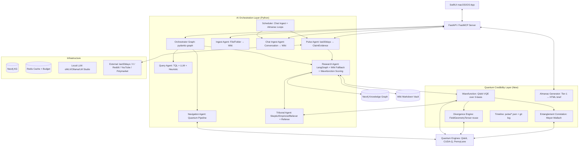
```mermaid
graph TD
    UI[SwiftUI macOS/iOS App] <--> API[FastAPI / FastMCP Server]
    
    subgraph AI_Orch ["AI Orchestration Layer (Python)"]
        Orchestrator[Orchestrator Graph: pydantic-graph]
        Query[Query Agent: TQL + LLM + Heuristic]
        Research[Research Agent: LangGraph + Wiki Fallback + Wavefunction Scoring]
        Navigator[Navigation Agent: Quantum Pipeline]
        Ingest[Ingest Agent: File/Folder → Wiki]
        ChatIngest[Chat Ingest Agent: Conversation → Wiki]
        Pulse[Pulse Agent: last30days → ClaimEvidence]
        Tribunal[Tribunal Agent: Skeptic/Empiricist/Believer + Referee]
        Scheduler[Scheduler: Chat Ingest + Almanac Loops]
        
        Orchestrator --> Query
        Orchestrator --> Research
        Orchestrator --> Navigator
        Research --> Tribunal
        Pulse --> Research
        Scheduler --> ChatIngest
        Scheduler --> Pulse
    end
    
    subgraph Quantum ["Quantum Credibility Layer (New)"]
        WF[Wavefunction: Qiskit VQE over 3-basis]
        Div[Divergence Engine: FieldGeometryTensor reuse]
        Ent[Entanglement Correlation: Meyer-Wallach]
        Time[Timeline: pulse/*.json + git log]
        Almanac[Almanac Generator: Tier-1 → HTML brief]
    end
    
    subgraph Infra ["Infrastructure"]
        Neo4j[(Neo4j KG)]
        Redis[(Redis Cache + Budget)]
        LLM[Local LLM: oMLX/Ollama/LM Studio]
        External[External: last30days / X / Reddit / YouTube / Polymarket]
    end
    
    API <--> Orchestrator
    API <--> Ingest
    API <--> ChatIngest
    API <--> Pulse
    API <--> Almanac
    Research <--> Graph[(Neo4j Knowledge Graph)]
    Research <--> Wiki[(Wiki Markdown Vault)]
    Research <--> WF
    WF --> Div
    WF --> Ent
    WF --> Tribunal
    Pulse <--> External
    Navigator <--> QEngine[Quantum Engines: Qiskit, CUDA-Q, PennyLane]
    WF <--> QEngine
    Div <--> QEngine
    Ent <--> QEngine
```

- **Orchestrator**: Managed via `pydantic-graph` for top-level routing with confidence gating.
- **Research Agent**: Now wires `ClaimWavefunction` when recent pulse evidence exists (14-day window), with graceful heuristic fallback. Populates `inferred_events` and `inferred_entities` from wavefunction-scored claims (previously dead since audit).
- **Pulse Agent**: Entity-scoped `last30days` ingestion via subprocess (`shell=False` always), budget guard with atomic Lua, writes immutable dated snapshots to `wiki/raw/pulse/`.
- **Tribunal Agent**: 3-role adversarial synthesis (Skeptic, Empiricist, Believer) + Referee. Only triggers for contested claims or divergence spikes > 0.7. Cost control: uncontested claims never trigger tribunal.
- **Living Almanac**: Autonomous daily brief — Tier-1 pulse → wavefunction → divergence → tribunal → HTML+md in `wiki/raw/almanac/`, self-contained (inline CSS, no JS, dark mode, print-friendly), idempotency via hash, dry-run mode.
- **Budget Tracker**: Redis-backed atomic monthly ceiling with HOLD threshold (2x cost remaining). Follows MilimoClaw's REVIEW→HOLD approval shape.

---

## 🌀 Living Almanac — The New Thing

The Living Almanac is the quantum credibility engine that replaces hardcoded confidence constants with quantum-scored states derived from real corroboration.

### Data Flow

```
last30days CLI (external, opt-in)
      |
      v
src/agents/pulse_agent.py  (periodic, entity-scoped, budget-guarded)
      |
      v
src/quantum_credibility/
   ├── wavefunction.py       (claim state: superposition → collapse via VQE)
   ├── divergence_engine.py  (repoints tensor.py machinery at real drift)
   ├── entanglement_corr.py  (Meyer-Wallach over co-occurrence patterns)
   └── vectorizer.py         (claims → FieldGeometryTensor factory)
      |
      v
src/agents/tribunal_agent.py  (multi-agent adversarial synthesis, LangGraph)
      |
      v
src/wiki/writer.py  (writes scored, sourced content to wiki + raw/)
      |
      v
src/almanac/
   ├── timeline.py           (git log + pulse/*.json reconstruction)
   └── almanac_generator.py  (assembles dated HTML brief)
      |
      v
src/scheduler.py  (periodic_almanac_loop alongside chat ingest loop)
```

### Core Concepts

| Concept | What It Does |
|---------|--------------|
| **Claim Wavefunction** | Claim encoded as quantum state over {CORROBORATED, CONTESTED, UNVERIFIED}. Amplitudes from source_diversity, engagement_magnitude, polymarket_prior, contradiction_signal. Collapses when evidence sharply peaks. |
| **Social vs Epistemic** | `social_traction` (decayed engagement) and `epistemic_confidence` are separate numbers, never merged. Weight via named constant `SOCIAL_TRACTION_WEIGHT_IN_EPISTEMIC=0.15`. |
| **Divergence Engine** | Repoints `FieldGeometryTensor` + `find_optimal_path` divergence_risk math at real question: how far has last 30 days discourse drifted from canon. Returns driving claims. |
| **Entanglement Correlation** | Meyer-Wallach scorer measures how tightly two entities are bound by independent corroboration, not wiki-editor cross-ref. |
| **Timeline (Time Slider)** | `GET /entities/{name}/timeline?days=30` returns chartable array — watch a claim's confidence evolve. No new TSDB, just `wiki/raw/pulse/` + `git log`. |
| **Tribunal** | Skeptic (absence+contradiction), Empiricist (diversity+market), Believer (lore consistency). Referee notes where they disagreed. All citations preserved. |
| **Autonomous Almanac** | "State of the Anomaly" — self-publishing dated HTML brief with zero human intervention. |

### Endpoints

| Method | Path | Purpose |
|--------|------|---------|
| `POST` | `/pulse/{entity_name}` | Trigger pulse for entity (budget-guarded, network tier) |
| `GET` | `/pulse/history?entity_name=&limit=` | List pulse snapshots |
| `GET` | `/entities/{name}/divergence` | Divergence risk + driving claims |
| `GET` | `/entities/{name}/timeline?days=30` | Chartable time-series of confidence/traction/divergence |
| `GET` | `/entities/{name}/entanglement?candidate=&limit=` | Quantum entanglement correlation |
| `POST` | `/entities/{name}/tribunal` | Run tribunal for claim |
| `GET` | `/budget/status` | Monthly spend, remaining, HOLD flag |
| `POST` | `/budget/approve` | Clear HOLD |
| `POST` | `/almanac/generate?dry_run=` | Trigger almanac generation |
| `GET` | `/almanac/history?limit=` | List published briefs |

---

## 📊 Presentation Slide Deck

An in-depth presentation outlining the project vision, quantum architectures, and local AI agent networks:

- 📥 **Download Deck**: [PDF Presentation](assets/other/Project_Chicken_Soup_Quantum_AI.pdf) | [PowerPoint PPTX](assets/other/Project_Chicken_Soup_Quantum_AI.pptx)

### Slides Preview

<p align="center">
  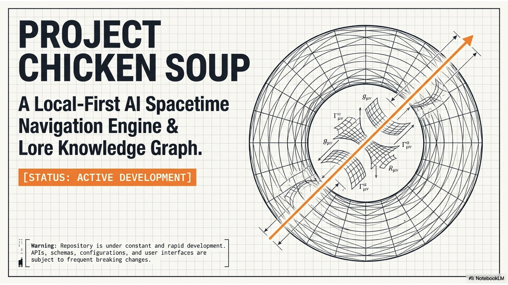
</p>

<details>
  <summary>🔍 Click to expand and view all 11 slides</summary>
  <br/>
  <p align="center">
    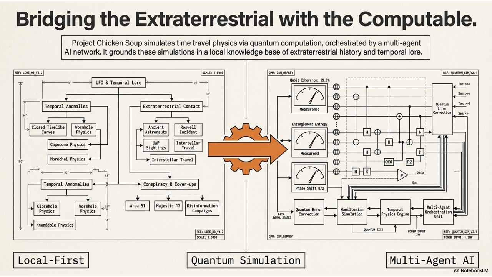<br/><br/>
    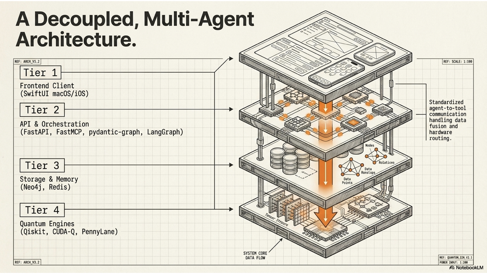<br/><br/>
    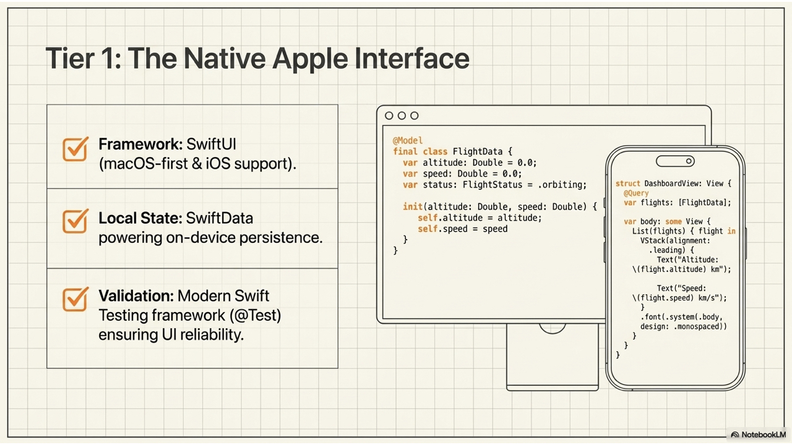<br/><br/>
    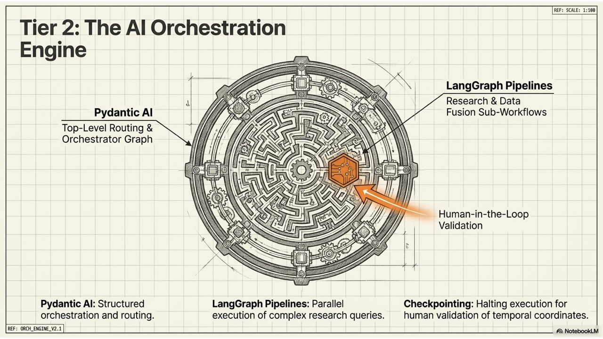<br/><br/>
    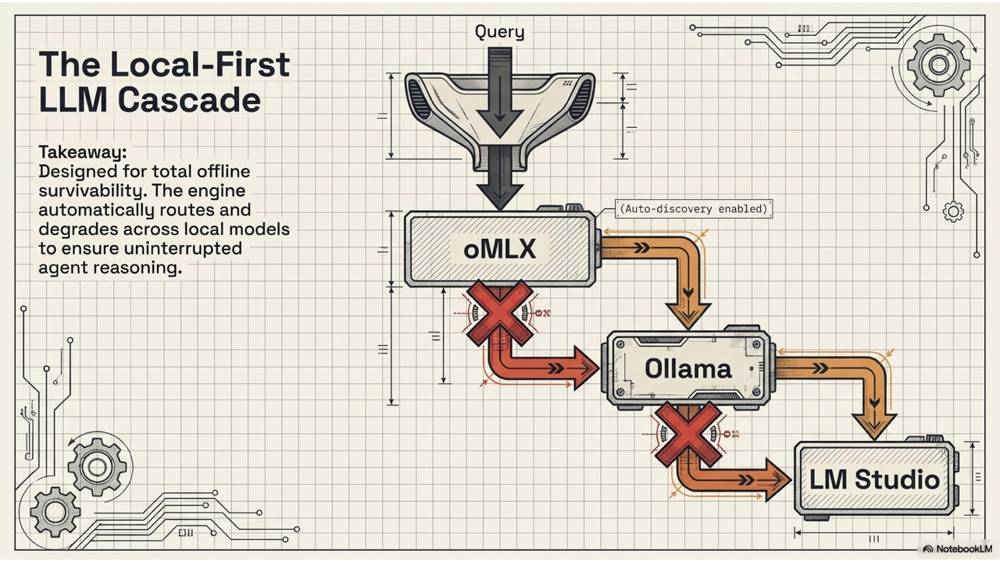<br/><br/>
    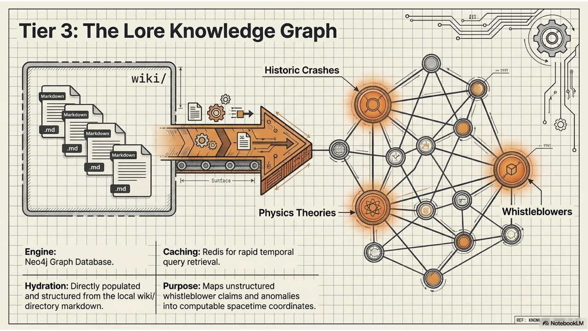<br/><br/>
    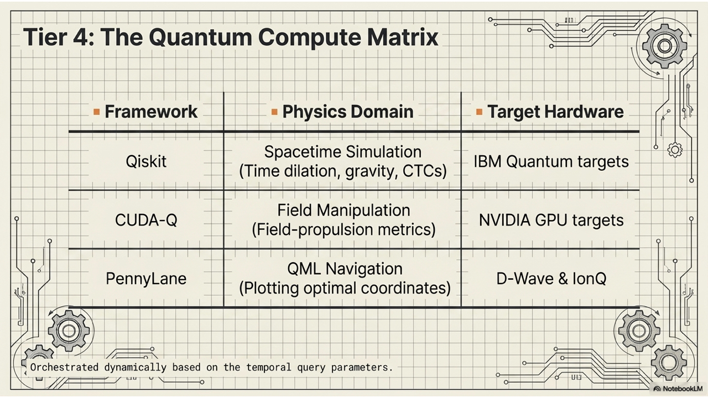<br/><br/>
    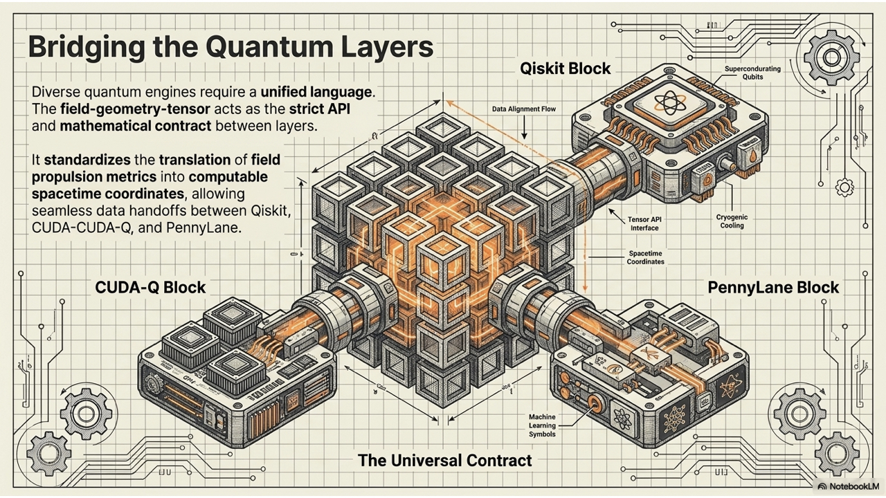<br/><br/>
    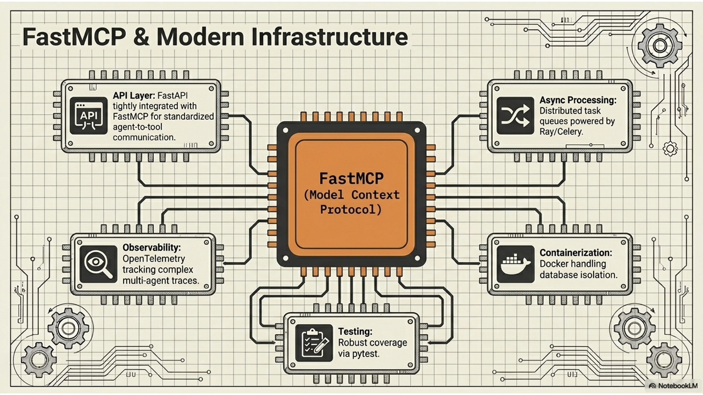<br/><br/>
    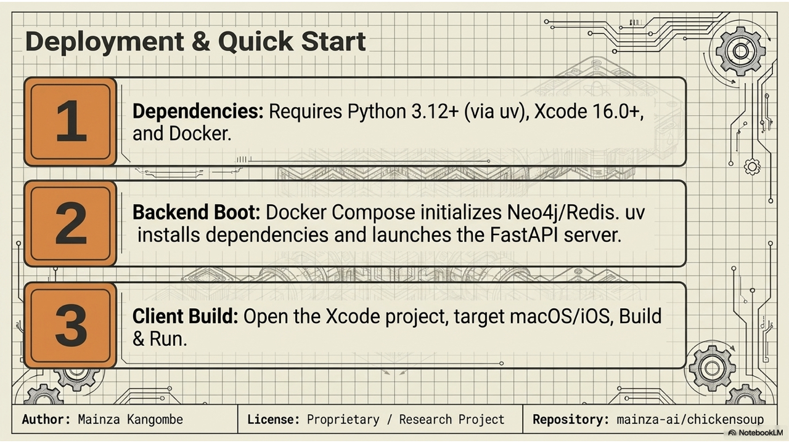
  </p>
</details>

---

## 📸 Screen Demonstrations & Video

### 🎥 Demo Video

Watch the Spacetime Navigation Engine & Lore Knowledge Graph in action:

[](https://www.youtube.com/watch?v=orRyWnZc4Ek)

🔗 **Link**: [Watch on YouTube](https://www.youtube.com/watch?v=orRyWnZc4Ek)

### 🖥️ Application Screenshots

<p align="center">
  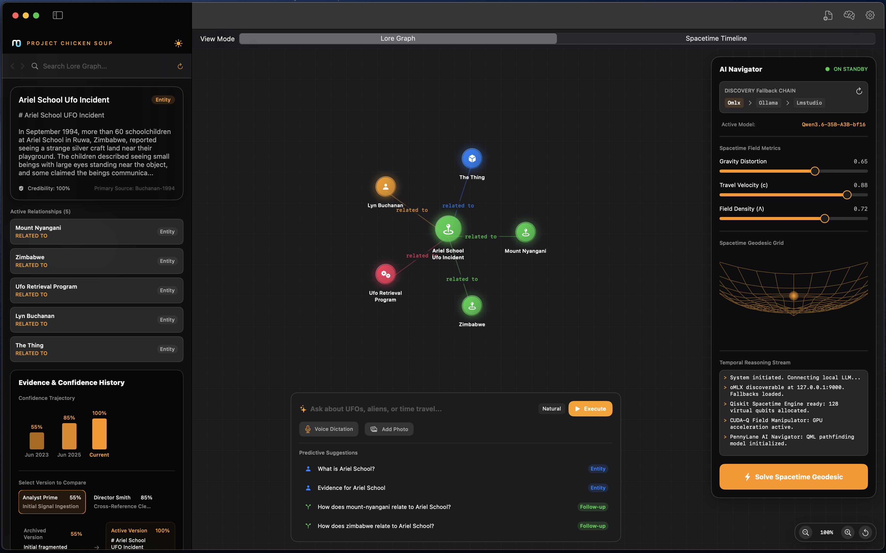
  <br/>
  <em>macOS Client Interactive Lore Graph Exploration</em>
</p>

<p align="center">
  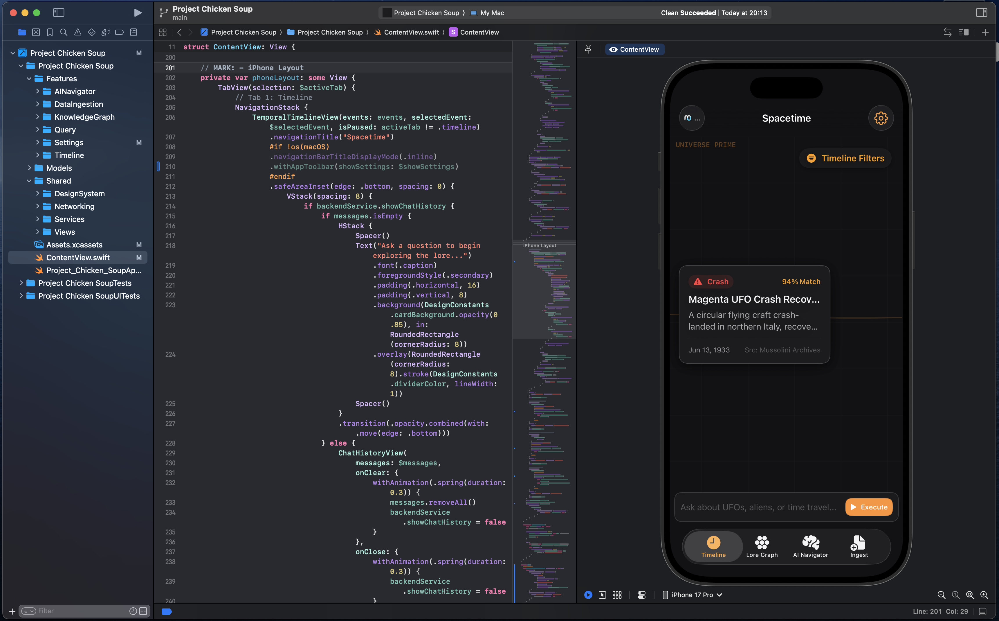
  <br/>
  <em>iOS Client Graph Exploration Interface</em>
</p>

---

## 🛠️ Technology Stack

| Layer | Technologies |
| :--- | :--- |
| **Frontend Client** | [SwiftUI](file:///Users/mck/Desktop/chickensoup/Project%20Chicken%20Soup) (macOS & iOS, 50+ files), SwiftData, Swift Testing, os.Logger |
| **API Layer** | FastAPI 40+ endpoints, FastMCP (Model Context Protocol), WebSockets, custom API Key Security Middleware |
| **Agent AI** | Pydantic AI, `pydantic-graph`, LangGraph (checkpointing, human-in-the-loop, tribunal), Langchain |
| **Quantum Credibility** | `quantum_credibility/wavefunction.py` (VQE over 3-basis), `divergence_engine.py` (tensor reuse), `entanglement_corr.py` (Meyer-Wallach), `vectorizer.py` (claims→tensor) |
| **Quantum Tier** | Qiskit (Spacetime — AerEstimatorV2 pattern), CUDA-Q (Field), PennyLane (Pathfinding QML), Quantum Hardware Job Scheduler |
| **Databases** | Neo4j (Knowledge Graph), Redis (Cache + Budget + Celery broker) |
| **Ingestion** | `pulse_agent.py` (last30days subprocess, budget-guarded), `last30days_adapter.py` (JSON+markdown normalization) |
| **Wiki Layer** | `writer.py` (YAML CRUD), `paths.py` (central resolver), `pulse_writer.py` (immutable snapshots), `backup.py`, `cleanup.py`, `budget.py` (Lua atomic) |
| **Observability** | OpenTelemetry tracing + 11 custom metrics: `agent_loop_executions`, `quantum_simulation_duration`, `pulse_runs_total`, `pulse_latency_seconds`, `budget_spent_usd`, `wavefunction_state_total{state,collapsed}`, `divergence_risk`, `tribunal_runs_total{trigger}`, `almanac_generated_total`, `almanac_generation_duration_seconds` |
| **Infrastructure** | Docker, Celery (Asynchronous Ingestion Workers), pytest 75 passing, `uv` package manager |

---

## 📂 Project Structure

```
chickensoup/
├── development-docs/       # Project specifications & architecture docs
│   ├── PROJECT_SPEC.md     # Core technical specification
│   └── chickensoup-living-almanac-implementation-spec.md  # Living Almanac spec (new)
├── wiki/                   # Markdown wiki (250+ pages: entities, concepts, projects)
│   ├── entities/           # 87 pages (people, craft, places, events, programs)
│   ├── concepts/           # 155 pages (ideas, theories, frameworks + credibility/almanac docs)
│   ├── projects/           # 7 pages (time travel machinery + living almanac plan)
│   ├── raw/                # Immutable source documents
│   │   ├── pulse/          # (NEW) Dated pulse snapshots — entity-scoped evidence
│   │   └── almanac/        # (NEW) Dated HTML+md State of the Anomaly briefs
│   └── plan/               # (NEW) Frontend settings menu plan for final DOD
├── Project Chicken Soup/   # Native SwiftUI client (macOS & iOS, 50+ Swift files)
├── src/                    # Backend source code (48 Python files, was 22)
│   ├── main.py             # FastAPI entry point (40+ endpoints + WebSocket + Living Almanac routes)
│   ├── config.py           # Config — now includes LAST30DAYS_* + WAVEFUNCTION_* + ALMANAC_* flags
│   ├── models.py           # Pydantic models — now ClaimEvidence, ClaimConfidence, DivergenceResult, PulseResult, etc.
│   ├── budget.py           # (NEW) BudgetTracker with Lua atomic check+incr, HOLD flag, approve_hold
│   ├── last30days_adapter.py  # (NEW) Normalizes last30days CLI JSON/md output to ClaimEvidence[]
│   ├── cache.py            # Redis cache + invalidation
│   ├── tasks.py            # Celery tasks (fixed metric_tensor bug)
│   ├── observability.py    # OpenTelemetry — now 11 metrics including pulse/budget/wavefunction/divergence/tribunal/almanac
│   ├── multi_llm.py        # Multi-LLM consensus via Jaccard
│   ├── quantum_scheduler.py# Job routing to D-Wave, IonQ, IBM Quantum
│   ├── scheduler.py        # Chat-to-wiki loop (5min) + Almanac loop (24h interval, idempotency)
│   ├── api/auth.py         # API key header auth (dev mode bypass)
│   ├── agents/             # 7 agents (was 4)
│   │   ├── orchestrator.py # pydantic-graph routing with confidence gating + synthesize_answer
│   │   ├── query_agent.py  # TQL→LLM→heuristic 3-tier intent parsing
│   │   ├── research_agent.py # LangGraph 6 nodes — now wires wavefunction scoring + inferred_events
│   │   ├── navigation_agent.py # pipelines spacetime→field→path
│   │   ├── ingest_agent.py # file→wiki analysis
│   │   ├── chat_ingest_agent.py # conversation→wiki
│   │   ├── pulse_agent.py  # (NEW) entity-scoped last30days ingestion, budget-guarded, shell=False
│   │   └── tribunal_agent.py # (NEW) Skeptic/Empiricist/Believer + Referee, gated cost control
│   ├── quantum_credibility/  # (NEW) Quantum credibility module
│   │   ├── wavefunction.py # ClaimWavefunction 3-basis VQE scoring
│   │   ├── divergence_engine.py # Narrative divergence via tensor+pathfinder reuse
│   │   ├── entanglement_corr.py # Meyer-Wallach over co-occurrence
│   │   └── vectorizer.py   # Claims→vector, canon→vector, vector→FieldGeometryTensor
│   ├── almanac/            # (NEW) Living Almanac artifacts
│   │   ├── timeline.py     # pulse/*.json + git log → chartable TimelinePoints
│   │   └── almanac_generator.py # generate_daily_almanac() dry-run + idempotency + HTML
│   ├── spacetime_engine/   # Qiskit layer + new extractors
│   │   ├── tensor.py       # FieldGeometryTensor ADM 3+1
│   │   ├── qiskit_simulation.py # Spacetime metrics (legacy Aer path + numpy)
│   │   ├── entanglement.py # (NEW) Meyer-Wallach reusable scorer
│   │   └── vqe_runner.py   # (NEW) AerEstimatorV2 wrapper, claim state circuits
│   ├── wiki/               # Wiki vault layer
│   │   ├── writer.py       # Page CRUD + LOG_IGNORE_PATTERNS for pytest isolation
│   │   ├── paths.py        # (NEW) Central WIKI_DIR resolver
│   │   ├── pulse_writer.py # (NEW) Immutable pulse snapshots json+md
│   │   ├── backup.py       # Snapshot export/import
│   │   └── cleanup.py      # Content vs engineering preservation
│   └── knowledge_graph/    # Neo4j layer
│       ├── ingest.py       # Relationship extraction + retry/backoff + Cypher sanitization
│       ├── connection.py   # Driver lifecycle
│       ├── queries.py      # Cypher templates
│       └── schema.py       # Constraints + indexes
├── tests/                  # Backend tests (19 files, 75 passing — was 9)
│   └── test_pulse_agent.py, test_budget.py, test_wavefunction.py,
│       test_divergence_engine.py, test_entanglement_corr.py,
│       test_tribunal_agent.py, test_timeline_endpoint.py, test_almanac_generator.py + original suite
├── AGENTS.md               # LLM Agent instructions & wiki schema + Apple guides index
├── CHANGELOG.md            # Project release log
└── pyproject.toml          # Python build config & dependencies
```

---

## 🚀 Getting Started

### 1. Requirements & Dependencies
- **Python**: 3.12+ (managed with `uv` or `.python-version`)
- **Xcode**: 16.0+ (for SwiftUI client)
- **Services**: Docker (for Neo4j & Redis)
- **Optional (Living Almanac)**: `last30days` CLI (`npx last30days`) + API keys for X, Perplexity, ScrapeCreators, Brave (only if `LAST30DAYS_ENABLED=true`)

### 2. Backend Setup
```bash
cp .env.example .env
docker-compose up -d
uv sync
uv run uvicorn src.main:app --reload
# or
.venv/bin/python -m pytest tests/ --ignore=tests/test_pdf_ingest.py -q
```

### 3. Living Almanac — To Reach Final DOD

```bash
# 1. Install last30days skill (optional, only for live data)
npm install -g last30days
# or use npx last30days

# 2. Enable in .env
echo "LAST30DAYS_ENABLED=true" >> .env
echo "LAST30DAYS_MONTHLY_BUDGET_USD=20" >> .env
echo "LAST30DAYS_COST_PER_PULL_USD=0.50" >> .env

# 3. Run one real pulse
curl -X POST http://127.0.0.1:8000/pulse/bob-lazar \
  -H "Content-Type: application/json" \
  -d '{"handles":{"x":"@bob_lazar"}}'

# Verify: wiki/raw/pulse/bob-lazar-*.json + .md appear, budget decremented
# GET /budget/status should show spent $0.50, remaining $19.50

# 4. Check scoring
curl http://127.0.0.1:8000/entities/bob-lazar/divergence
curl "http://127.0.0.1:8000/entities/bob-lazar/timeline?days=30"
curl http://127.0.0.1:8000/entities/bob-lazar/entanglement

# 5. Dry-run almanac (no file writes, no budget spend)
curl -X POST "http://127.0.0.1:8000/almanac/generate?dry_run=true"

# 6. Live almanac after manual verification
curl -X POST "http://127.0.0.1:8000/almanac/generate?dry_run=false"
# → wiki/raw/almanac/{date}.html + .md with real sourced content

# 7. Let scheduler run overnight (set Tier-1 entities in wiki frontmatter tier: 1)
# By morning, a dated brief appears unattended in wiki/raw/almanac/
```

### 4. SwiftUI Client Setup
```bash
open "Project Chicken Soup/Project Chicken Soup.xcodeproj"
```
Build and run target `Project Chicken Soup` on **macOS** or **iOS**.
Optional: Run unit tests using Swift Testing framework (`@Test`).
See also: `wiki/plan/frontend-settings-menu.md` for Living Almanac settings UI plan.

---

## 📚 The Lore Wiki

The knowledge graph is hydrated from structured markdown files in the [wiki/](file:///Users/mck/Desktop/chickensoup/wiki) directory (250+ content pages and growing).

Pages are automatically created through:
- **File/Folder Upload**: Upload `.txt`/`.md`/`.json`/`.csv` files → AI analyzes content → wiki pages created with cross-references → synced to Neo4j.
- **Chat-to-Wiki Pipeline**: Enable in Settings → conversations with 10+ messages are periodically analyzed → entities, concepts, and projects extracted → wiki pages auto-created.
- **Pulse Agent (NEW)**: Entity-scoped `last30days` ingestion → immutable snapshots in `wiki/raw/pulse/` → quantum-scored confidence via wavefunction → divergence/tribunal → almanac brief in `wiki/raw/almanac/`.

| Wiki Section | Count | Description |
|:---|---:|:---|
| [Entities](file:///Users/mck/Desktop/chickensoup/wiki/entities) | 87 | People, places, objects, events, programs |
| [Concepts](file:///Users/mck/Desktop/chickensoup/wiki/concepts) | 155 | Theories, frameworks, ideas, claims including credibility engine + almanac docs |
| [Projects](file:///Users/mck/Desktop/chickensoup/wiki/projects) | 7 | Engineering work, architecture, specifications + Living Almanac plan |
| [Raw](file:///Users/mck/Desktop/chickensoup/wiki/raw) | 80+ | Immutable source docs + Apple platform guides + pulse snapshots + almanac briefs |
| [Plan](file:///Users/mck/Desktop/chickensoup/wiki/plan) | 1 | Frontend settings menu plan for final DOD |

### Advanced Capabilities & Services

* **Consensus-based Multi-LLM Querying**: `/consensus/query` routes across multiple local LLM providers, calculating consensus scores.
* **Auto-Discovery Fallback**: Resolves active local LLM runtime (oMLX, Ollama, LM Studio) dynamically.
* **Wiki Backup & Restore**: Pre-mutation snapshots in `src/wiki/backup.py`.
* **Wiki Cleanup & Sanitation**: Deletes lore content while preserving engineering docs.
* **API Authentication Security**: `X-API-Key` header validation on mutating endpoints. Last30days tier gated by `LAST30DAYS_ENABLED` with `source_tier` labeling (`local` vs `network_opt_in`).
* **Budget Guardrails**: Monthly ceiling, atomic Lua check+incr, HOLD threshold, `POST /budget/approve` to clear.
* **MCP Integration**: FastMCP exposing 6 custom tools.
* **Observability (OpenTelemetry)**: 11 metrics including `pulse_runs_total`, `budget_spent_usd`, `wavefunction_state_total`, `divergence_risk`, `tribunal_runs_total`, `almanac_generated_total`, plus tracing and latency histograms.
* **Almanac Artifacts**: Self-contained HTML briefs (inline CSS, no JS, dark mode via `@media (prefers-color-scheme: dark)`, print-friendly) in `wiki/raw/almanac/`.

---

## 🔐 Security Notes

- `pulse_agent.py` always uses `shell=False` with list args — entity names with `; rm -rf /` are passed as single arg, not interpreted.
- `budget.py` uses Redis Lua for atomic check+increment — safe across workers.
- `writer.py` has `LOG_IGNORE_PATTERNS` to prevent pytest temp paths from polluting `wiki/log.md`.
- `_sanitize_entity_name` rejects null bytes, newlines, caps at 200 chars.
- `wiki/paths.py` centralizes `WIKI_DATA_DIR` resolution (was duplicated 6x).
- All 8 new endpoints reuse `Depends(verify_api_key)` for mutating routes; read-only divergence/timeline/entanglement are public.

---

## 👥 Author

- **Mainza Kangombe** — [LinkedIn](https://www.linkedin.com/in/mainza-kangombe-6214295/)

---

## 📝 License

Proprietary / Research Project.
