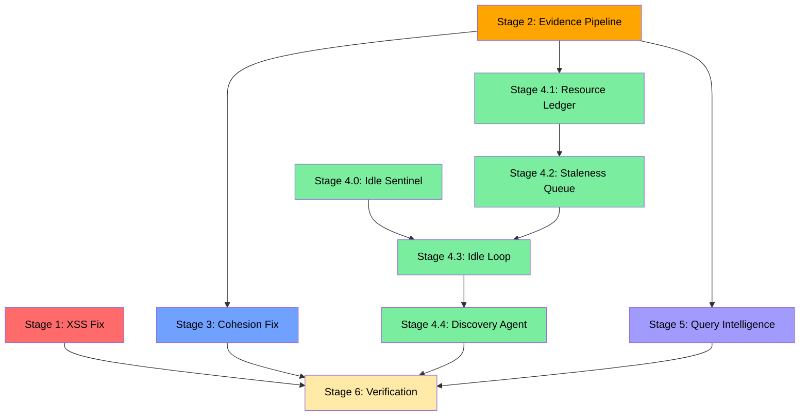

# Master Implementation Plan — Living Almanac Hardening & Idle-Driven Redesign

This document is the single-source-of-truth synthesis of **four** development specifications for the next major phase of Project Chicken Soup's Living Almanac system. It consolidates insights from three independent audits into one resolved, sequenced, actionable plan.

> [!IMPORTANT]
> **Source Document Hierarchy**: This document synthesizes four sources with a strict conflict-resolution order:
> 1. `chickensoup-master-implementation-prompt.md` (the sequencing/conflict-resolution layer)
> 2. The three source documents it governs (diagnosis, bug sweep, idle spec)
> 3. `AGENTS.md` → `PROJECT_SPEC.md` → existing code patterns

## Table of Contents

1. [Situation Assessment](#1-situation-assessment)
2. [Root Cause Analysis](#2-root-cause-analysis)
3. [Conflict Resolution](#3-conflict-resolution)
4. [Non-Negotiable Constraints](#4-non-negotiable-constraints)
5. [Stage 1 — Security Fix](#5-stage-1--security-fix-xss)
6. [Stage 2 — Evidence Pipeline Fix](#6-stage-2--evidence-pipeline-fix)
7. [Stage 3 — Cohesion Fix](#7-stage-3--cohesion-fix)
8. [Stage 4 — Idle-Driven Scheduling Redesign](#8-stage-4--idle-driven-scheduling-redesign)
9. [Stage 5 — Query Intelligence Gaps](#9-stage-5--query-intelligence-gaps)
10. [Stage 6 — Verification Pass](#10-stage-6--verification-pass)
11. [New Architecture Components](#11-new-architecture-components)
12. [Data Models](#12-data-models)
13. [Dependency Graph](#13-dependency-graph)
14. [PR Breakdown](#14-pr-breakdown)
15. [Definition of Done](#15-definition-of-done)

---

## 1. Situation Assessment

### What Works (Confirmed by Live Audit)

The architecture is sound and the scaffolding is genuinely well-built:

- **80/80 tests pass** on current `main` (commit `74935f0`)
- **Reused math** — `FieldGeometryTensor`, Meyer-Wallach entanglement scoring, VQE estimator pattern all exist and are operational
- **Real budget controls** — `BudgetTracker` with Redis Lua-script atomic check (`BUDGET_LUA_CHECK`, `BUDGET_HOLD_LUA`) is correct and reusable
- **Safe defaults** — `LAST30DAYS_ENABLED=False`, shell=False subprocess calls confirmed (the `Bob Lazar; rm -rf /` test fixture in `wiki/raw/pulse/` proves this was tested)
- **Wavefunction scoring reaches live queries** — `research_agent.py` wires `ClaimWavefunction` into the live query path via `_compute_wavefunction_scores` and `found_nodes`, not just the almanac
- **`inferred_entities`/`inferred_events` are no longer dead** — populated from wavefunction scores when pulse evidence exists (previously a standing API-honesty gap)
- **End-to-end verified** (2026-07-12) — after 4 cascading bug fixes (workspace root, Swift double-encoding, execute permission, timeout), `POST /pulse/Bob%20Lazar` → success with 50 evidence items, almanac generates with real content

### What Doesn't Work (The Headline Finding)

**The evidence pipeline is capturing almost no real signal.** Across 604 evidence items collected from real `last30days` pulls:

| Metric | Value |
|--------|-------|
| Items with nonzero engagement | 4 / 604 (0.7%) |
| Items with Polymarket odds | 2 / 604 (0.3%) |
| Items with garbled claim text (JSON fragments) | Majority |
| Wavefunction scores | Identical `epi=0.16 trac=0.00` across **every** entity |
| Divergence scores (Bob Lazar / Element 115 / Roswell) | 43.5% / 40.3% / 42.9% — within 3-point band despite wildly different evidence quality |

> [!CAUTION]
> The daily brief currently running is **not doing what it's described as doing**. The wavefunction model is correctly reporting "I was given almost no usable information" — the honest failure mode — but every downstream consumer (almanac, LinkedIn narrative, market-weighted corroboration claims) is operating on noise dressed as data.

### Current Bug Inventory

| ID | Severity | Source | Description | Status |
|----|----------|--------|-------------|--------|
| B1 | **CRITICAL** | Bug Sweep §1 | Stored XSS in almanac HTML — zero `html.escape()` calls, adversary-reachable content | **Open** |
| B2 | **CRITICAL** | Diagnosis §Root cause | Adapter parsing wrong part of last30days output — `parse_json_output()` looks for nonexistent keys | **Open** |
| B3 | **HIGH** | Diagnosis §Root cause | Entity-resolution mode mismatch — Element 115 pulled AI recruiting job listings | **Open** |
| B4 | **HIGH** | Bug Sweep §2+§3 | Cadence-tier config dead (zero references), `_ALMANAC_LAST_RUN` in-memory (resets on restart) → 4x duplicate pulses | **Superseded by Stage 4** |
| B5 | **MEDIUM** | Bug Sweep §4 | Three disconnected confidence systems that don't know about each other | **Open** |
| B6 | **MEDIUM** | Diagnosis §Still not cohesive | Multi-turn context missing from reasoning layer (`Orchestrator.execute` has no `history` param) | **Open** |
| B7 | **MEDIUM** | Diagnosis §Still not cohesive | No semantic entity resolution — Element 115 collision is direct cost | **Open** |
| B8 | **LOW** | Bug Sweep §5 | Divergence scores suspiciously uniform — likely resolves when adapter is fixed | **Dependent on B2** |
| B9 | **MEDIUM** | Idle Spec §0 | `BudgetTracker` charges flat `$0.50` regardless of actual backend used — free-tier penalized | **Open** |

---

## 2. Root Cause Analysis

### Bug B2: Adapter Schema Mismatch

The adapter expects:
```json
{"claims": [...]}  // or "evidence" / "results" / "findings"
```

The real output shape (confirmed from `wiki/raw/pulse/roswell-crash-2026-07-11.json`) is:
```json
{
  "artifacts": {"grounding": [...], "resolved": {...}},
  "clusters": [{"cluster_id": "cluster-1", "candidate_ids": ["https://reddit.com/..."], ...}],
  ...
}
```

`parse_json_output()` returns `None` → falls through to `parse_markdown_output()` → treats pretty-printed JSON as markdown prose → claim text becomes literal JSON key-value pairs (`"title": "30 years later: video of Roswell parts moving in 500kV field"`) and URL-only "claims" from `candidate_ids`.

### Bug B3: Entity-Resolution Mode Mismatch

`last30days` defaults to company-research resolution mode (its README use case). For "Element 115", it runs `probe:greenhouse:element115`, `probe:ashby:element115` — treating it as a company name and checking whether it's hiring. Collides with `element115.ai`, an unrelated AI recruiting startup.

### Bug B9: Flat-Cost Assumption

`BudgetTracker` charges `LAST30DAYS_COST_PER_PULL_USD` (default `$0.50`) unconditionally. But the actual pull metadata already self-reports backend usage: `"keyless_backend": "ddg"`, `"reason": "keyless-search-unavailable"`. A user running entirely on free backends (Reddit public JSON, DuckDuckGo keyless, YouTube, GitHub unauth, HN Algolia) is blocked by a budget ceiling protecting against costs they're not incurring.

---

## 3. Conflict Resolution

> [!IMPORTANT]
> **The One Conflict That Must Be Resolved Correctly**

Two source documents prescribe conflicting fixes for the same problems:

| Problem | Bug Sweep Fix (§2, §3) | Idle Scheduling Fix (§1) | **Resolution** |
|---------|------------------------|--------------------------|----------------|
| Dead cadence-tier config | **Patch**: Wire `TIER1_HOURS`/`TIER2_HOURS` into `pulse_agent.run_pulse()` | **Delete**: Replace with staleness queue + idle sentinel | **→ Delete (Idle Spec wins)** |
| In-memory `_ALMANAC_LAST_RUN` | **Patch**: Persist to Redis | **Delete**: Replace with `record_pulse_completed()` in Redis sorted set | **→ Delete (Idle Spec wins)** |

**Rationale**: The bug-sweep patches were the *minimum viable fix* before the idle-driven redesign existed as a spec. Since both are being implemented in the same pass, patching the old clock-based system first is wasted work that gets immediately deleted.

**Every other item across all three documents stands as written, with no conflict.**

---

## 4. Non-Negotiable Constraints

These are merged from all three source documents and the master prompt. They are absolute requirements:

1. **Security first, independent of everything else** — The XSS gap in `almanac_generator.py` touches adversary-reachable content in an unattended, auto-publishing system. Same-day fix regardless of what else is in flight.

2. **Don't build new consumers on unverified data** — Fix the evidence pipeline (Stage 2) and verify differentiated scores on real entities *before* wiring the resource ledger's backend-metadata reading on top of it.

3. **Delete, don't layer** — Per §3 conflict resolution above. No patching of dead config before deleting it.

4. **All persistent scheduling/staleness state lives in Redis** — `QuantumJobScheduler._jobs_db` and `_ALMANAC_LAST_RUN` are two instances of the same bug pattern. Do not introduce a third.

5. **Multi-resource cost tracking never cross-charges** — Free-backend usage and paid-backend usage stay on separate ledgers.

6. **New-entity creation requires human review; refreshing existing entities does not** — Direct fix for the Element 115 misattribution class of bug. New discoveries land as `status: draft-needs-review`, never auto-published.

7. **Don't break what exists** — All 80 currently-passing tests stay green. Every stage gets its own test file built against real captured data from `wiki/raw/pulse/*.json`.

---

## 5. Stage 1 — Security Fix (XSS)

**Source**: `deeper-bug-sweep.md §1`
**Priority**: Same-day, blocking nothing, blocked by nothing
**Estimated effort**: < 1 hour

### Problem

`src/almanac/almanac_generator.py` builds HTML through raw f-string interpolation. Zero calls to `html.escape()`, no `import html`. Every dynamic value — `entity_name`, `claim_text`, `referee_synthesis`, `dis.get(...)` fields — traces back to content pulled from public Reddit/X/web pages via `last30days`. Adversary-reachable input in an unattended, auto-publishing system.

### Fix

1. Add `import html` to `almanac_generator.py`
2. Wrap every dynamic value in `html.escape()` before interpolation
3. Add XSS-payload test: feed a claim containing `<script>alert(1)</script>` through the generator, assert output HTML contains escaped entities, not raw tags

### Files Changed

- `src/almanac/almanac_generator.py` — add escaping at every interpolation site
- `tests/test_almanac_xss.py` — new test file

### Acceptance Criteria

- [ ] Almanac HTML output is escaped and passes the XSS fixture test
- [ ] All 80 existing tests still pass

---

## 6. Stage 2 — Evidence Pipeline Fix

**Source**: `almanac-live-diagnosis-and-roadmap.md`, Phase 0, items 1–5
**Priority**: Foundation for everything downstream — **do not proceed past this stage until verified**
**Estimated effort**: 2–4 hours

### Problem

The entire evidence pipeline is producing near-noise because the adapter is parsing the wrong schema (see [[#2. Root Cause Analysis]]).

### Fix Steps

1. **Rebuild `parse_json_output()`** in `src/last30days_adapter.py` against the real schema: `{"artifacts": {...}, "clusters": [...]}`
2. **Check companion `.md` file** — determine if the per-pull `.md` file (e.g., `roswell-crash-2026-07-11.md`) is the actual polished, cited brief; switch `pulse_agent.py` to consume it if so
3. **Add data-quality guard** — flag low-signal pulls (nonzero-engagement-count == 0 and claim text matches URL pattern) rather than silently feeding near-empty evidence to the scorer
4. **Fix entity-resolution mismatch** — suppress or down-weight `jobs-web`/hiring-signal probe results for entities not tagged as organizations; populate `last30days_handles` frontmatter for active Tier-1 entities
5. **Re-run and verify** — run against Bob Lazar, Element 115, Roswell Crash, Kordylewski Clouds; confirm scores actually differentiate using existing broken outputs in `wiki/raw/pulse/` as the "before" comparison

### Files Changed

- `src/last30days_adapter.py` — rebuild `parse_json_output()` to match real schema
- `src/agents/pulse_agent.py` — potentially switch to consuming `.md` companion files
- `wiki/entities/bob-lazar.md` — populate `last30days_handles` frontmatter
- `wiki/entities/element-115.md` — populate `last30days_handles`, tag as non-organization
- `wiki/entities/roswell-crash.md` — populate `last30days_handles`
- `wiki/entities/kordylewski-clouds.md` — populate `last30days_handles`
- `tests/test_adapter_real_schema.py` — new test file using real captured output as fixtures (NOT synthetic mocks)

### Acceptance Criteria

- [ ] `parse_json_output()` correctly parses the real `{"artifacts": {...}, "clusters": [...]}` schema
- [ ] Test fixtures built from actual `wiki/raw/pulse/*.json` files, not synthetic mocks
- [ ] Re-run against same 4 entities produces differentiated scores (not identical `epi=0.16`)
- [ ] Element 115 no longer pulls hiring-signal data from `element115.ai`

> [!CAUTION]
> **Hard gate**: Do not proceed past Stage 2 until step 5 passes. Every subsequent stage assumes real, differentiated evidence signal.

---

## 7. Stage 3 — Cohesion Fix

**Source**: `deeper-bug-sweep.md §4`
**Priority**: Small, independent, do anytime after Stage 2
**Estimated effort**: 1–2 hours

### Problem

Three disconnected confidence systems exist:

| System | Location | What It Does |
|--------|----------|-------------|
| `_apply_adaptive_confidence()` | `scheduler.py` | Appends plain-text `"Confidence: reinforced Nx across conversations"` to wiki page body |
| `ClaimWavefunction` | `quantum_credibility/wavefunction.py` | Evidence-derived quantum state over {CORROBORATED, CONTESTED, UNVERIFIED} |
| `credibility_scoring_node` | `research_agent.py` | Heuristic fallback (`+0.1 Person`, `+0.15 Project`) |

A claim reinforced across 5 separate conversations AND with strong last30days corroboration gets **no combined benefit** — the systems have never spoken to each other.

### Fix

Feed `scheduler.py`'s `_get_reinforcement_count(slug)` into `ClaimWavefunction` as an additional evidence input. Reinforcement-across-conversations is the same *kind* of signal as reinforcement-across-platforms — it becomes one more input to the wavefunction's evidence list rather than a separate side channel.

### Files Changed

- `src/quantum_credibility/wavefunction.py` — accept reinforcement count as additional input
- `src/scheduler.py` — expose `_get_reinforcement_count()` for import
- `tests/test_cohesion_wavefunction.py` — new test: entity with high reinforcement + strong evidence scores visibly higher than either signal alone

### Acceptance Criteria

- [ ] An entity reinforced across chat conversations AND independently corroborated by last30days shows a visibly higher wavefunction confidence than one with only one signal or the other
- [ ] Reinforcement count integrated as `source_diversity` / `engagement_magnitude` input, not a separate confidence annotation

---

## 8. Stage 4 — Idle-Driven Scheduling Redesign

**Source**: `chickensoup-idle-driven-scheduling-spec.md`, all phases
**Priority**: Replaces the clock entirely (per §3 conflict resolution)
**Estimated effort**: 8–16 hours across 5 sub-phases

> [!IMPORTANT]
> This is the largest stage. It introduces four new files, modifies `scheduler.py` fundamentally, and deletes the old cadence config. Sub-phases have strict internal dependencies.

### Architecture

```
Request traffic (/query, WebSocket, chat ingest, tribunal runs)
        |
        v
src/idle_sentinel.py  (NEW — system-wide activity tracking)
        |
        v  (fires only when idle, cooperatively yields on new activity)
src/staleness_queue.py  (NEW — Redis-backed priority queue)
        |
        v
src/resource_ledger.py  (NEW — replaces flat-cost BudgetTracker)
        |
        v
src/agents/pulse_agent.py  (EXISTING — unchanged interface)
        |
        v
src/discovery_agent.py  (NEW — idle-time entity discovery, gated)
        |
        v
src/almanac/almanac_generator.py  (EXISTING — triggered by batch completion, not clock)
```

### Phase 0 — Idle Sentinel

**New file**: `src/idle_sentinel.py`

```python
class IdleSentinel:
    """
    System-wide activity tracker. Tracks via Redis timestamps:
      - last_query_at           (updated in main.py post_query)
      - last_websocket_activity_at  (updated on /ws/agent message)
      - active_tribunal_runs    (inc/dec around tribunal_agent.run_tribunal)
      - active_chat_ingest      (existing tracking in scheduler.py)

    is_idle(threshold_minutes: int = 5) -> bool
    """
```

Cooperative background loop helper:
```python
async def run_while_idle(work_unit_fn, threshold_minutes=5, check_interval_seconds=30):
    """Re-checks idle between every work unit, not just before starting a batch."""
```

**Config**: `IDLE_THRESHOLD_MINUTES: int = 5`

**Wire points**: `post_query` in `main.py`, WebSocket handler, `tribunal_agent.run_tribunal` entry/exit, existing chat-ingest tracking.

**Test**: `tests/test_idle_sentinel.py` — simulate a `post_query` mid-batch, assert background loop yields within one `check_interval_seconds` cycle.

### Phase 1 — Multi-Resource Ledger

**New file**: `src/resource_ledger.py` (extends/wraps `src/budget.py`)

```python
class ResourceLedger:
    """
    Two independent ledgers, never cross-charged:
    1. paid_ledger: dollar ceiling (LAST30DAYS_MONTHLY_BUDGET_USD)
       Charged only for paid backends (ScrapeCreators, Perplexity, X API)
    2. free_ledger: requests-per-hour courtesy ceiling (FREE_TIER_REQUESTS_PER_HOUR)
       Charged for keyless/free backends (Reddit public JSON, DuckDuckGo, YouTube, GitHub, HN)

    check_and_charge(pull_result_metadata: dict) -> LedgerDecision
    """
```

Reads actual `keyless_backend` / `.label` fields from pull metadata instead of flat `$0.50` per pull.

**Config additions**:
```python
FREE_TIER_REQUESTS_PER_HOUR: int = 60
FREE_TIER_ENABLED: bool = True
```

> [!WARNING]
> **Dependency**: Phase 1 reads backend-used metadata from pulls. Depends on Stage 2's adapter fix being correct. Verify this dependency explicitly before starting.

**Test**: `tests/test_resource_ledger.py` — keyless-only pull charges free ledger only; paid-backend pull charges dollar ledger at actual cost.

### Phase 2 — Staleness Priority Queue

**New file**: `src/staleness_queue.py`

```python
def compute_staleness_score(entity_slug: str) -> float:
    """
    Composite score (higher = more urgent). Inputs:
      - days_since_last_pulse (Redis last-pulse-at index)
      - reinforcement_count (scheduler.py's _get_reinforcement_count)
      - current divergence_risk (divergence_engine)
      - state_label == "contested" (contested claims are higher priority)
    """

def get_next_batch(n: int) -> List[str]:
    """Redis sorted-set pop of n highest-staleness entity slugs."""

def record_pulse_completed(entity_slug: str):
    """Updates Redis last-pulse-at index. Proper persistence, not in-memory."""
```

**This phase deletes**:
- `LAST30DAYS_ENTITY_CADENCE_TIER1_HOURS` from `config.py`
- `LAST30DAYS_ENTITY_CADENCE_TIER2_HOURS` from `config.py`

The `tier:` frontmatter field on entity pages is **kept** as one input into `compute_staleness_score` (manual priority nudge) rather than the sole scheduling mechanism.

**Test**: `tests/test_staleness_queue.py` — entity with high reinforcement + divergence spike ranks above stable entity pulsed yesterday. Config diff confirms TIER1/TIER2 actually removed.

### Phase 3 — Idle Ingestion Loop

**Modifies**: `src/scheduler.py` — replaces `periodic_almanac_loop()`

```python
async def idle_ingestion_loop():
    """
    Runs continuously. On each cycle:
    1. If IdleSentinel.is_idle(), pull next batch from staleness_queue
    2. Run pulse_agent + wavefunction + divergence per entity
    3. Respect ResourceLedger limits (stop batch, don't error, on ceiling)
    4. After meaningful batch (queue drained or N entities refreshed),
       trigger almanac_generator.generate_daily_almanac()
    """
```

**This phase deletes**:
- `_ALMANAC_LAST_RUN` from `scheduler.py`
- `_ALMANAC_CHECK_INTERVAL_SECONDS` from `scheduler.py`

**Test**: `tests/test_idle_ingestion_loop.py` — mocked idle sentinel toggle mid-loop; assert work stops within one cycle. Simulate rapid-restart pattern (4x Bob Lazar bug) — confirm no redundant pulses.

### Phase 4 — Discovery Agent

**New file**: `src/discovery_agent.py`

```python
class DiscoveryAgent:
    """
    Runs only after staleness queue is reasonably drained.
    Uses entanglement_corr's co-occurrence detection to find names
    that repeatedly appear in evidence for existing entities but
    have no wiki page.

    Any candidate gets written with:
        status: draft-needs-review
        discovered_via: entanglement_correlation
        discovered_from: [source entity slugs]
        discovered_at: <timestamp>

    NEVER writes a fully published entity page.
    """
```

**New endpoints**:
- `GET /entities/drafts` — list draft entities pending review
- `POST /entities/{slug}/promote` — human promotes draft → published

**Test**: `tests/test_discovery_agent.py` — synthetic co-occurrence produces `draft-needs-review` page, never fully-published.

---

## 9. Stage 5 — Query Intelligence Gaps

**Source**: `almanac-live-diagnosis-and-roadmap.md`, Phases 1 & 2
**Priority**: Independent of Stages 2–4, can run in parallel
**Estimated effort**: 4–8 hours

### Multi-Turn Context Wiring

Thread conversation history from `post_query` through `Orchestrator.execute()` → `ClassifyNode` → `ResearchNode`. Currently `Orchestrator.execute(self, query, thread_id, human_approved)` has no `history` parameter. A user asking "why is that contested?" after getting a wavefunction-scored answer cannot resolve, because the system has no memory of what "that" refers to.

### Semantic Entity Resolution

Add a disambiguation check before a pulse commits evidence to an entity:
- Compare semantic similarity between the entity's existing wiki content and the resolved evidence's actual subject matter
- Reject/flag evidence that's semantically off-topic even if the string matched
- This is the direct preventive fix for the Element 115 class of error
- Also strengthens Stage 4's `DiscoveryAgent` against false-positive entity creation

### Files Changed

- `src/main.py` — pass conversation history to orchestrator
- `src/agents/research_agent.py` — accept history in execute, thread through ClassifyNode → ResearchNode
- `src/agents/pulse_agent.py` — add semantic disambiguation check before evidence commit
- `tests/test_multi_turn_context.py` — "that claim" / "him" resolves correctly in follow-up
- `tests/test_semantic_disambiguation.py` — Element-115-style collision caught or quarantined

### Acceptance Criteria

- [ ] Follow-up question referencing "that claim" or "him" from previous turn resolves correctly
- [ ] Synthetic Element-115-style name collision is either caught by semantic disambiguation or quarantined as low-confidence with clear flagging

---

## 10. Stage 6 — Verification Pass

**Source**: All three documents' "what done looks like" sections
**Priority**: Final, not optional — this is NOT a code PR but a full system validation

### Verification Checklist

| Stage | Verification | Pass? |
|-------|-------------|-------|
| 1 | Almanac HTML output is escaped, XSS fixture test passes | ☐ |
| 2 | Live pulse against real entity produces evidence with nonzero engagement and correct claim text (not JSON fragments) | ☐ |
| 3 | Entity reinforced via chat AND last30days shows visibly higher confidence than either alone | ☐ |
| 4a | Running with `LAST30DAYS_ENABLED=true` + no paid keys → idle time drives staleness-queue work paced by free-tier ledger | ☐ |
| 4b | Live query mid-drain gets immediate response | ☐ |
| 4c | Restarting process mid-cycle does NOT cause redundant re-pulsing | ☐ |
| 4d | Draft entity from discovery agent has `status: draft-needs-review`, never auto-published | ☐ |
| 5a | Follow-up "that claim" / "him" resolves correctly | ☐ |
| 5b | Element-115-style collision caught or quarantined with clear flag | ☐ |

> [!IMPORTANT]
> These must be verified **together in one sitting** against a real running instance — not six isolated unit-test passes.

---

## 11. New Architecture Components

### New Files

| File | Type | Stage | Description |
|------|------|-------|-------------|
| `src/idle_sentinel.py` | NEW | 4.0 | System-wide activity tracker, generalizes `is_conversation_idle()` |
| `src/staleness_queue.py` | NEW | 4.2 | Redis-backed priority queue, replaces dead Tier1/Tier2 config |
| `src/resource_ledger.py` | NEW | 4.1 | Multi-resource cost tracking, extends `budget.py` |
| `src/discovery_agent.py` | NEW | 4.4 | Idle-time entity discovery, gated to `draft-needs-review` |
| `tests/test_almanac_xss.py` | NEW | 1 | XSS payload test |
| `tests/test_adapter_real_schema.py` | NEW | 2 | Real schema parsing tests |
| `tests/test_cohesion_wavefunction.py` | NEW | 3 | Reinforcement + wavefunction integration |
| `tests/test_idle_sentinel.py` | NEW | 4.0 | Idle detection and preemption |
| `tests/test_resource_ledger.py` | NEW | 4.1 | Multi-resource charging |
| `tests/test_staleness_queue.py` | NEW | 4.2 | Composite staleness scoring |
| `tests/test_idle_ingestion_loop.py` | NEW | 4.3 | Idle loop with preemption and restart safety |
| `tests/test_discovery_agent.py` | NEW | 4.4 | Draft entity creation gating |
| `tests/test_multi_turn_context.py` | NEW | 5 | Conversation history threading |
| `tests/test_semantic_disambiguation.py` | NEW | 5 | Entity collision detection |

### Modified Files

| File | Stage | Changes |
|------|-------|---------|
| `src/almanac/almanac_generator.py` | 1 | Add `html.escape()` at all interpolation sites |
| `src/last30days_adapter.py` | 2 | Rebuild `parse_json_output()` for real schema |
| `src/agents/pulse_agent.py` | 2, 4.1, 5 | Companion `.md` consumption, ResourceLedger integration, semantic check |
| `src/quantum_credibility/wavefunction.py` | 3 | Accept reinforcement count input |
| `src/scheduler.py` | 3, 4.3 | Expose `_get_reinforcement_count()`, replace `periodic_almanac_loop()` with `idle_ingestion_loop()` |
| `src/config.py` | 4.1, 4.2 | Add `FREE_TIER_*`, `IDLE_THRESHOLD_MINUTES`; remove `TIER1_HOURS`/`TIER2_HOURS` |
| `src/budget.py` | 4.1 | Wrapped by `resource_ledger.py`, Lua scripts reused |
| `src/main.py` | 4.0, 4.4, 5 | Wire idle sentinel, add draft/promote endpoints, pass conversation history |
| `src/agents/research_agent.py` | 5 | Accept and thread conversation history |

### Deleted Code

| What | Stage | Why |
|------|-------|-----|
| `LAST30DAYS_ENTITY_CADENCE_TIER1_HOURS` from `config.py` | 4.2 | Replaced by staleness queue composite scoring |
| `LAST30DAYS_ENTITY_CADENCE_TIER2_HOURS` from `config.py` | 4.2 | Same |
| `_ALMANAC_LAST_RUN` from `scheduler.py` | 4.3 | Replaced by Redis-persisted `record_pulse_completed()` |
| `_ALMANAC_CHECK_INTERVAL_SECONDS` from `scheduler.py` | 4.3 | Replaced by idle-driven triggering |
| `periodic_almanac_loop()` from `scheduler.py` | 4.3 | Replaced by `idle_ingestion_loop()` |

---

## 12. Data Models

### ResourceLedger Models

```python
class LedgerDecision(BaseModel):
    allowed: bool
    ledger_type: Literal["paid", "free", "none"]
    charged_amount: float
    remaining: float
    reason: str

class ResourceLedgerStatus(BaseModel):
    paid_spent: float
    paid_ceiling: float
    paid_remaining: float
    free_requests_this_hour: int
    free_requests_ceiling: int
    free_remaining: int
```

### Staleness Queue Models

```python
class StalenessScore(BaseModel):
    entity_slug: str
    score: float
    components: Dict[str, float]  # days_stale, reinforcement, divergence, contested_bonus
    computed_at: str

class DiscoveredEntity(BaseModel):
    slug: str
    title: str
    status: Literal["draft-needs-review"]
    discovered_via: str  # "entanglement_correlation"
    discovered_from: List[str]  # source entity slugs
    discovered_at: str
    confidence: float
```

---

## 13. Dependency Graph



### Key Dependencies

- **Stage 1** (XSS) is independent — can start immediately
- **Stage 2** (Adapter) is the foundation — blocks Stages 3, 4.1, 5
- **Stage 3** (Cohesion) requires Stage 2 — small, slot in anytime after
- **Stage 4.0** (Idle Sentinel) is independent — can start alongside Stage 2
- **Stage 4.1** (Resource Ledger) requires Stage 2 — reads backend metadata from fixed adapter
- **Stage 4.2** (Staleness Queue) requires Stage 4.1
- **Stage 4.3** (Idle Loop) requires Stages 4.0, 4.1, 4.2 — the PR that deletes old clock
- **Stage 4.4** (Discovery Agent) requires Stage 4.3
- **Stage 5** (Query Intelligence) requires Stage 2, can run parallel with Stage 4
- **Stage 6** (Verification) requires ALL of the above

### Parallelization Opportunities

Two independent tracks can run simultaneously after Stage 2:

| Track A (Scheduling) | Track B (Query) |
|-----------------------|-----------------|
| Stage 4.0 (Idle Sentinel) | Stage 5 (Multi-turn + Semantic resolution) |
| Stage 4.1 (Resource Ledger) | |
| Stage 4.2 (Staleness Queue) | |
| Stage 4.3 (Idle Loop) | |
| Stage 4.4 (Discovery Agent) | |

Stage 3 (Cohesion) can slot in anywhere along either track after Stage 2.

---

## 14. PR Breakdown

| PR | Content | Dependencies | Review Focus |
|----|---------|-------------|-------------|
| **PR 1** | Stage 1 — XSS fix | None | Smallest, most urgent, ships alone |
| **PR 2** | Stage 2 — Adapter fix | None | Foundation; nothing in Stage 4 merges before this is verified |
| **PR 3** | Stage 3 — Reinforcement → wavefunction | PR 2 verified | Small, independent |
| **PR 4** | Stage 4.0 + 4.1 — Idle sentinel, resource ledger | PR 2 verified | Phase 1 explicitly blocked on Stage 2 |
| **PR 5** | Stage 4.2 + 4.3 — Staleness queue, idle loop | PR 4 | **Review carefully against non-negotiable #3**: this deletes `_ALMANAC_LAST_RUN` and dead cadence config |
| **PR 6** | Stage 4.4 — Discovery agent | PR 5 | Depends on idle loop existing |
| **PR 7** | Stage 5 — Multi-turn context, semantic resolution | PR 2 verified | Can run parallel with Stage 4's later phases; different part of codebase (query path vs. scheduling) |
| **PR 8** | Stage 6 — Verification pass | All above | Not a code PR — end-to-end validation against running instance |

---

## 15. Definition of Done

Everything in Stage 6's verification checklist, verified together in one sitting against a real running instance:

> The almanac that gets auto-published at the end of this work should be running on **real, differentiated, correctly-escaped evidence**; scheduled by **idle time and actual staleness** rather than a clock that forgets itself on restart; charging cost against **the resource that's actually being spent**; and capable of **answering a follow-up question about what it just told you**.

Specifically:
1. Run with `LAST30DAYS_ENABLED=true`, no paid API keys (pure free-tier), no queries for 30 minutes
2. Confirm: idle sentinel detects idle state → staleness queue drains highest-priority entities → free-tier ledger paces it (not dollar ceiling) → live `/query` mid-drain gets immediate response → draft entity from discovery has `draft-needs-review` status
3. Restart process mid-cycle → confirm nothing gets redundantly re-pulsed
4. Verify almanac HTML is escaped, evidence has real engagement data, scores differentiate across entities

---

## See Also

- [[living-almanac]] — Full implementation history (phases 0–6, 75+ tests, troubleshooting)
- [[credibility-scoring]] — Claim wavefunction scoring system
- [[agent-architecture]] — Multi-agent orchestration
- [[field-geometry-tensor]] — Contract between quantum layers
- [[pulse-agent]] — Entity-scoped last30days ingestion
- [[quantum-credibility-wavefunction]] — Quantum state scoring
- [[divergence-engine]] — Narrative drift measurement
- [[entanglement-correlation]] — Cross-platform entity binding
- [[tribunal-agent]] — Adversarial synthesis for contested claims

---

## Source Documents (Raw)

- [chickensoup-master-implementation-prompt.md](file:///Users/mck/Desktop/chickensoup/development-docs/chickensoup-master-implementation-prompt.md) — The authoritative sequencing layer
- [chickensoup-almanac-live-diagnosis-and-roadmap.md](file:///Users/mck/Desktop/chickensoup/development-docs/chickensoup-almanac-live-diagnosis-and-roadmap.md) — Live data diagnosis and evidence pipeline audit
- [chickensoup-deeper-bug-sweep.md](file:///Users/mck/Desktop/chickensoup/development-docs/chickensoup-deeper-bug-sweep.md) — Security/correctness/cohesion bug sweep
- [chickensoup-idle-driven-scheduling-spec.md](file:///Users/mck/Desktop/chickensoup/development-docs/chickensoup-idle-driven-scheduling-spec.md) — Idle-driven scheduling redesign spec
- [chickensoup-living-almanac-implementation-spec.md](file:///Users/mck/Desktop/chickensoup/development-docs/chickensoup-living-almanac-implementation-spec.md) — Original Living Almanac implementation spec
